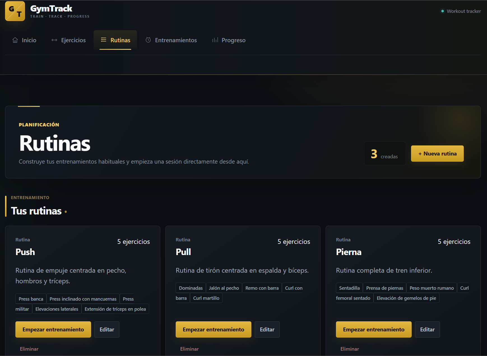
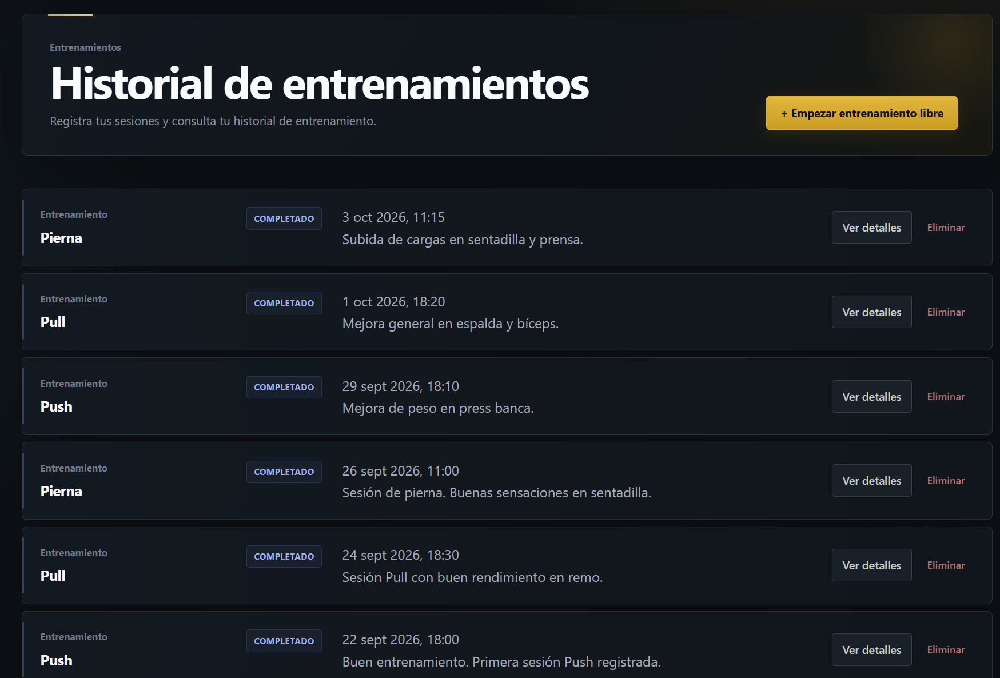
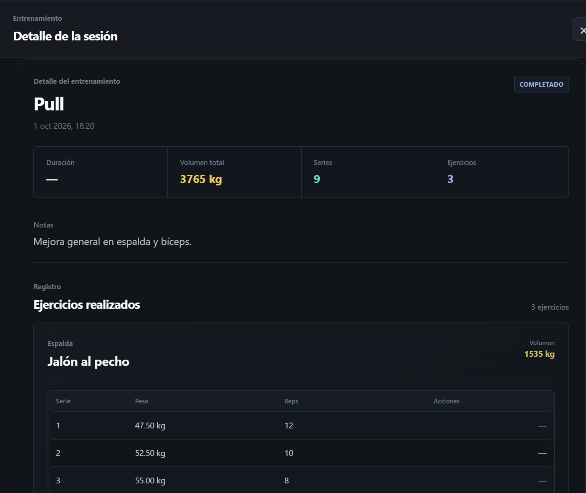

# GymTrack

GymTrack is a full-stack web application for managing gym routines, recording workout sessions and tracking training progress.

The project was developed as a practical way to deepen my knowledge of full-stack development, REST APIs, relational databases, testing and application deployment.

## Live Demo

**Application:** https://gymtrack-vr5p.onrender.com/

**Repository:** https://github.com/german-avila/GymTrack

> The backend is hosted on Render's free tier, so the first request after a period of inactivity may take a few seconds.

## Screenshots







## Features

### Exercise Management

- System exercise catalog with predefined exercises.
- Create custom exercises.
- Edit and delete user-created exercises.
- System exercises are protected from modification or deletion.
- Search exercises by name.
- Filter exercises by muscle group.

### Routine Management

- Create custom workout routines.
- Add multiple exercises to each routine.
- Edit routine information and exercises.
- Delete routines.
- Start a workout directly from a routine.
- Routine creation and updates are handled transactionally in PostgreSQL.

### Live Workouts

- Start a free workout or create one from an existing routine.
- Only one active workout can exist at a time.
- Add and remove exercises while the workout is active.
- Add, edit and delete sets.
- Record repetitions and weight.
- Persistent workout timer.
- Complete workouts and keep them as read-only history.
- View workout duration, total volume, number of sets and exercises.

### Performance Insights

During an active workout, GymTrack provides information about previous performance for each exercise.

It includes:

- Previous workout performance.
- Maximum weight achieved.
- Estimated one-repetition maximum (1RM) using the Epley formula.
- Personal record detection.
- Exercise volume.

### Progress Tracking

- Select an exercise and inspect its training history.
- View number of workouts and recorded sets.
- View best weight and best repetitions.
- Visualize weight progression using charts.
- Review individual sets from previous workouts.

## Tech Stack

### Frontend

- React
- TypeScript
- Vite
- Recharts
- CSS

### Backend

- Node.js
- Express
- TypeScript
- REST API

### Database

- PostgreSQL
- SQL migrations
- Relational data model
- PostgreSQL transactions

### Testing

- Vitest
- Supertest
- Dedicated PostgreSQL test database
- Integration testing

### Infrastructure

- Docker
- Docker Compose
- Render
- Neon PostgreSQL
- Git
- GitHub

## Testing

The backend currently includes **22 integration tests** executed against an isolated PostgreSQL test database.

The test suite covers:

- API health checks.
- Database connection and environment isolation.
- Exercise CRUD operations.
- Protection of system exercises.
- Routine creation, update and deletion.
- Transaction rollback when invalid routine data is provided.
- Workout creation.
- Prevention of multiple active workouts.
- Workout creation from routines.
- Workout completion.
- Protection of completed workouts.
- Exercise progress calculations.
- Training history ordering.
- Best weight and repetition calculations.

Tests can be executed with:

```bash
cd backend
npm test
```

## Architecture

GymTrack follows a client-server architecture:

```text
React + TypeScript
        |
        | HTTP / REST API
        v
Node.js + Express
        |
        | SQL
        v
PostgreSQL
```

The frontend communicates with the backend through REST endpoints.

The backend contains the application logic and communicates with PostgreSQL for data persistence.

## Database Model

The main entities are:

```text
Exercise
   |
   | many-to-many
   v
RoutineExercise
   ^
   |
Routine


Routine
   |
   | optional
   v
Workout
   |
   v
WorkoutExercise
   |
   v
WorkoutSet
```

### Main tables

- `exercises`
- `routines`
- `routine_exercises`
- `workouts`
- `workout_exercises`
- `workout_sets`

A **Routine** represents a reusable training template.

A **Workout** represents an actual training session.

Each workout contains performed exercises, and each exercise contains its corresponding sets.

## Project Structure

```text
GymTrack/
├── backend/
│   ├── database/
│   │   └── migrations/
│   ├── src/
│   │   ├── constants/
│   │   ├── controllers/
│   │   ├── database/
│   │   ├── routes/
│   │   ├── app.ts
│   │   └── index.ts
│   └── tests/
│
├── frontend/
│   └── src/
│       ├── components/
│       ├── pages/
│       ├── services/
│       └── types/
│
├── compose.yaml
└── README.md
```

## Local Development

### Prerequisites

Make sure the following tools are installed:

- Node.js
- npm
- Docker
- Docker Compose

### 1. Clone the repository

```bash
git clone https://github.com/german-avila/GymTrack.git
cd GymTrack
```

### 2. Start PostgreSQL

The project includes a Docker Compose configuration for local development.

```bash
docker compose up -d
```

This starts PostgreSQL with the following configuration:

```text
Database: gymtrack
User: gymtrack
Password: gymtrack
Port: 5432
```

### 3. Apply database migrations

Copy the migration files into the PostgreSQL container:

```bash
docker cp backend/database/migrations gymtrack-postgres:/migrations
```

Execute the migrations in numerical order:

```bash
docker exec -it gymtrack-postgres sh -c 'for f in /migrations/*.sql; do psql -U gymtrack -d gymtrack -f "$f"; done'
```

The migrations create the complete database schema and seed the application with the system exercise catalog and demo data.

### 4. Configure the backend

Create a file named:

```text
backend/.env
```

With:

```env
PORT=3000
DB_HOST=localhost
DB_PORT=5432
DB_USER=gymtrack
DB_PASSWORD=gymtrack
DB_NAME=gymtrack
```

Then install the dependencies:

```bash
cd backend
npm install
```

Start the development server:

```bash
npm run dev
```

The API will be available at:

```text
http://localhost:3000
```

You can verify that it is running through:

```text
http://localhost:3000/api/health
```

### 5. Configure the frontend

From the project root, create:

```text
frontend/.env
```

With:

```env
VITE_API_URL=http://localhost:3000
```

Install the dependencies:

```bash
cd frontend
npm install
```

Start Vite:

```bash
npm run dev
```

Vite will display the local address where the frontend is available.

## Test Environment

Integration tests use a separate PostgreSQL database to avoid modifying development data.

### 1. Create the test database

With the PostgreSQL container running:

```bash
docker exec -it gymtrack-postgres psql -U gymtrack -c "CREATE DATABASE gymtrack_test;"
```

### 2. Configure the test environment

Create:

```text
backend/.env.test
```

With:

```env
DB_HOST=localhost
DB_PORT=5432
DB_USER=gymtrack
DB_PASSWORD=gymtrack
DB_NAME=gymtrack_test
```

### 3. Apply test database migrations

If the migration directory has not already been copied into the container:

```bash
docker cp backend/database/migrations gymtrack-postgres:/migrations
```

For the test database, apply the schema and system exercise migrations while skipping the demo routine and workout seed migrations (`011` and `012`):

```bash
docker exec -it gymtrack-postgres sh -c 'for f in /migrations/00[1-9]_*.sql /migrations/010_*.sql /migrations/013_*.sql; do psql -U gymtrack -d gymtrack_test -f "$f"; done'
```

### 4. Run the tests

```bash
cd backend
npm test
```

For watch mode:

```bash
npm run test:watch
```

## Production Build

### Backend

```bash
cd backend
npm install
npm run build
npm start
```

### Frontend

```bash
cd frontend
npm install
npm run build
```

The frontend production files are generated inside:

```text
frontend/dist
```

## Deployment

The application is deployed using:

- **Frontend:** Render Static Site
- **Backend:** Render Web Service
- **Database:** Neon PostgreSQL

The backend supports a production `DATABASE_URL` connection string while maintaining individual database environment variables for local development.

## What I Learned

Developing GymTrack allowed me to work through the complete lifecycle of a full-stack application.

Some of the main concepts I worked with include:

- Designing and implementing REST APIs.
- Building reusable React components with TypeScript.
- Designing a relational PostgreSQL database.
- Managing many-to-many and one-to-many relationships.
- Using SQL migrations to evolve the database schema.
- Using PostgreSQL transactions to preserve data integrity.
- Implementing application business rules in the backend.
- Managing asynchronous frontend/backend communication.
- Writing integration tests with Vitest and Supertest.
- Isolating tests using a dedicated PostgreSQL database.
- Using Docker for local infrastructure.
- Deploying a frontend, backend and database to production.
- Managing source code and project evolution with Git and GitHub.

## Future Improvements

Possible future improvements include:

- User authentication and multi-user support.
- Integration with an external exercise API.
- More advanced progress analytics.
- Evolution of estimated 1RM and training volume over time.
- Automated CI testing with GitHub Actions.
- Improved database migration automation.

## Author

**Germán Ávila**

Computer Engineering student at the Universitat Politècnica de València, specializing in Software Engineering.

- GitHub: https://github.com/german-avila
- LinkedIn: https://www.linkedin.com/in/german-avila-dev/